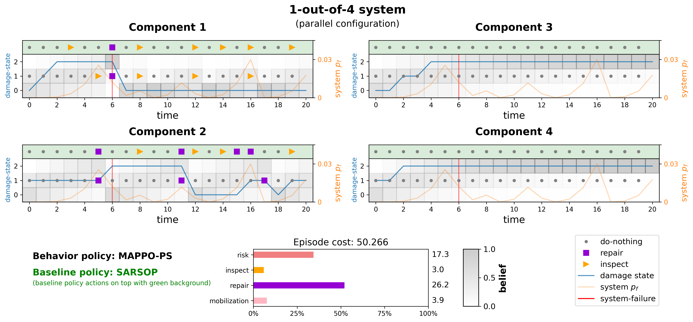

# Inspection and Maintenance Planning using Reinforcement Learning (IMPRL)


IMPRL is a Python library for deep reinforcement learning for inspection and maintenance (I&M) planning of engineering systems. It provides a collection of environments and single-agent and multi-agent algorithm implementations.




## Algorithms 🧠

### Reinforcement Learning (RL) Algorithms

The following reinforcement algorithms are implemented:

#### Single-agent algorithms

| Algorithm |Formulation | entry point |
|:--|:--|:--|
| [DDQN](./imprl/agents/DDQN.py) | off-policy, value-based | [train_and_log.py](./train_and_log.py) |
| [JAC](./imprl/agents/JAC.py) | off-policy, actor-critic | [train_and_log.py](./train_and_log.py) |
| [PPO](./imprl/agents/PPO.py) | on-policy, actor-critic | [imprl/agents/PPO.py](./imprl/agents/PPO.py) |

#### Multi-agent algorithms
| Algorithm | Formulation | entry point |
|:--|:--|:--|
| [DDMAC](./imprl/agents/DDMAC.py) / [DCMAC](./imprl/agents/DCMAC.py) | off-policy, actor-critic | [train_and_log.py](./train_and_log.py) |
| [IACC](./imprl/agents/IACC.py) / [IACC_PS](./imprl/agents/IACC_PS.py) | off-policy, actor-critic | [train_and_log.py](./train_and_log.py) |
| [MAPPO_PS](./imprl/agents/MAPPO_PS.py) | on-policy, actor-critic | [imprl/agents/MAPPO_PS.py](./imprl/agents/MAPPO_PS.py) |
| [QMIX_PS](./imprl/agents/QMIX_PS.py) | off-policy, value-based | [train_and_log.py](./train_and_log.py) |
| [VDN_PS](./imprl/agents/VDN_PS.py) | off-policy, value-based | [train_and_log.py](./train_and_log.py) |
| [IAC](./imprl/agents/IAC.py) / [IAC_PS](./imprl/agents/IAC_PS.py) | off-policy, actor-critic | [train_and_log.py](./train_and_log.py) |
| [IPPO_PS](./imprl/agents/IPPO_PS.py) | on-policy, actor-critic | [imprl/agents/IPPO_PS.py](./imprl/agents/IPPO_PS.py) |

- `PS` denotes parameter sharing between agents.
- The base off-policy actor-critic algorithm: ACER from [SAMPLE EFFICIENT ACTOR-CRITIC WITH EXPERIENCE REPLAY](https://arxiv.org/pdf/1611.01224.pdf) by Wang et al., an off-policy algorithm that uses weighted sampling for experience replay.


### Heuristic baselines

- We provide heuristic baselines such as [`inspect_repair`](imprl/imprl/baselines/inspection_repair.py) which finds optimal maintenance policies by optimizing inspection intervals and prioritizing component repairs.

- More simple polices such as [`do_nothing`](imprl/imprl/baselines/do_nothing.py) and [`failure_replace`](imprl/imprl/baselines/failure_replace.py) also provided. These require no optimization and are most suitable for sanity checks.

### SARSOP

- For `k_out_of_n_infinite` environments, it is possible to compute (near-)optimal policies using point-based value iteration algorithms for POMDPs (such as [SARSOP](https://www.roboticsproceedings.org/rss04/p9.pdf)). To enable visualization of SARSOP policies, we provide a wrapper for interfacing with SARSOP called [SARSOPAgent](./imprl/agents/SARSOP.py).

## Package Structure 🗂️

```text
imprl/
├── agents/                    # RL algorithms, configs, and training entry points
│   ├── configs/                  # default hyperparameter configs
│   ├── primitives/               # reusable networks, replay buffers, and schedulers
│   ├── __init__.py               # agent registry and factory
│   └── *.py                      # algorithm implementations
├── baselines/                 # heuristic and reference policies
├── envs/                      # environment registry, wrappers, and environment cores
│   ├── game_envs/                # matrix-game environments, wrappers, and configs
│   ├── structural_envs/          # k-out-of-n environments, wrappers, and configs
│   └── __init__.py               # env registry and factory
├── post_process/              # policy visualisation and result post-processing
│   ├── policy_visualizer.py      # rollout and belief-space plots
│   └── stats.py                  # summary statistics helpers
└── runners/                   # serial and parallel rollout utilities
    ├── parallel.py               # multiprocessing rollout helpers
    └── serial.py                 # single-process rollout and training helpers
```

## Installation 📦

#### 1) Install uv ⚡

uv is a fast Python package and project manager. See more install options:
[uv docs](https://docs.astral.sh/uv/getting-started/installation/)
```bash
# macOS (Homebrew)
brew install uv

# Or via script (Linux/macOS)
curl -LsSf https://astral.sh/uv/install.sh | sh
```

#### 2) Create a virtual environment

From the repository root:
```bash
uv venv --python 3.11
source .venv/bin/activate  # Windows: .venv\Scripts\activate
```

#### 3) Install dependencies via uv groups 📦

From this directory, install the base runtime deps defined in `pyproject.toml`. This install includes the core dependencies for running the library:
```bash
uv sync

# optionally install dev tools: pytest, black, ruff
uv sync --group dev
```
<details>
<summary> 3.1) PyTorch GPU support (optional)</summary>

  GPU notes (PyTorch): If you need a CUDA-enabled wheel, install a build matching
  your system from the official PyTorch index:
  https://pytorch.org/get-started/locally/

  Example (Linux, CUDA 12.1):
  ```bash
  uv pip install --index-url https://download.pytorch.org/whl/cu121 torch
  ```

  Check if PyTorch detects your GPU:
  ```bash
  python -c "import torch; print(torch.cuda.is_available())"
  ```
</details>

<details>
<summary> 3.2) Installing additional packages (optional) </summary>

Use `uv add <pkg>` to add packages to your project and lockfile. For example,
to add Jupyter Notebook:
```bash
uv add "notebook>=7.1.2,<8.0.0"
```
If resolution fails, relax version ranges and retry.
</details>

#### 4) Setup wandb

For logging, the library relies on [wandb](https://wandb.ai).You can log into wandb using your private API key, 

```bash
wandb login
# <enter wandb API key>
```

## Getting Started 🚀

#### Creating an environment

```python
import imprl.envs

# create an environment
env = imprl.envs.make(name="k_out_of_n_infinite", setting="hard-1-of-4_infinite")

# env uses the standard Gymnasium API.
obs, info = env.reset()

# select an action for each agent
action = [0, 1, 0, 2]

# step the environment
next_obs, reward, termination, truncation, info = env.step(action)
```

#### Training a DRL agent

Train a DDQN agent on the 1-out-of-4 infinite-horizon environment.

Default configs specifying the hyperparameters and environment configs are located at [`imprl/config/agents/DDQN.yaml`](./imprl/agents/configs/DDQN.yaml). We use [Hydra](https://hydra.cc/) for configuration management and you can override any of the default config values via the command line. For example, to disable logging to wandb, you can set `WANDB.mode=disabled`:

```bash
cd imprl
python train_and_log.py --config-name DDQN WANDB.mode=disabled
```

#### Visualizing policies

```python
from omegaconf import OmegaConf
from imprl.post_process import PolicyVisualizer

# create an environment
env = imprl.envs.make(name="k_out_of_n_infinite", setting="hard-1-of-4_infinite")

# create an agent
cfg = OmegaConf.load("imprl/agents/configs/IPPO_PS.yaml")
agent = imprl.agents.make(
    "IPPO_PS", env, OmegaConf.to_container(cfg, resolve=False), device
)

# (optional) load checkpoint
# agent.load_weights(checkpoint_dir, int(checkpoint))

plotter = PolicyVisualizer(env, agent)
plotter.plot()
```

You can find a detailed introduction in [getting_started.ipynb](./getting_started/getting_started.ipynb).


## Acknowledgements 🙏

This project utilizes the abstractions in [EPyMARL](https://github.com/uoe-agents/epymarl) and the author would like to acknowledge the insights shared in [Reinforcement Learning Implementation Tips and Tricks](https://agents.inf.ed.ac.uk/blog/reinforcement-learning-implementation-tricks/) for developing this library.

## Related Work 🔗

- [IMP-MARL](https://github.com/moratodpg/imp_marl): a Suite of Environments for Large-scale Infrastructure Management Planning via MARL
  - Benchmarking scalability of cooperative MARL methods in real-world infrastructure management planning problems.
  - Environments: (Correlated and uncorrelated) k-out-of-n systems and offshore wind structural systems.
  - RL solvers: Provides wrappers for interfacing with several (MA)RL libraries such as [EPyMARL](https://github.com/uoe-agents/epymarl), [Rllib](imp_marl/imp_wrappers/examples/rllib/rllib_example.py), [MARLlib](imp_marl/imp_wrappers/marllib/marllib_wrap_ma_struct.py) etc.

- [IMP-act](https://github.com/AI-for-Infrastructure-Management/imp-act): Benchmarking MARL for Infrastructure Management Planning at Scale with JAX
  - Large-scale road networks with up to 178 agents implemented in [JAX](https://jax.readthedocs.io/en/latest/) for scalability.
  - [IMP-act-JaxMARL](https://github.com/AI-for-Infrastructure-Management/imp-act-JaxMARL) interfaces IMP-act with multi-agent solvers in [JaxMARL](https://github.com/FLAIROx/JaxMARL).
  -  We also provide NumPy-based environments for compatibility with PyTorch in [IMP-act-epymarl](https://github.com/AI-for-Infrastructure-Management/imp-act-epymarl).


## Citation 📚
If you find this repository useful, please consider citing:

[Assessing the Optimality of Decentralized Inspection and Maintenance Policies for Stochastically Degrading Engineering Systems](https://link.springer.com/chapter/10.1007/978-3-031-74650-5_13) ([open access](https://research.tudelft.nl/en/publications/assessing-the-optimality-of-decentralized-inspection-and-maintena-2))

```bibtex
@inproceedings{bhustali_decentralization_2025,
title = "Assessing the Optimality of Decentralized Inspection and Maintenance Policies for Stochastically Degrading Engineering Systems",
author = "Prateek Bhustali and Andriotis, {Charalampos P.}",
year = "2025",
doi = "10.1007/978-3-031-74650-5_13",
isbn = "978-3-031-74649-9",
series = "Communications in Computer and Information Science",
publisher = "Springer",
pages = "236--254",
editor = "Oliehoek, {Frans A.} and Manon Kok and Sicco Verwer",
booktitle = "Artificial Intelligence and Machine Learning",
url = "https://link.springer.com/chapter/10.1007/978-3-031-74650-5_13",
}
```
